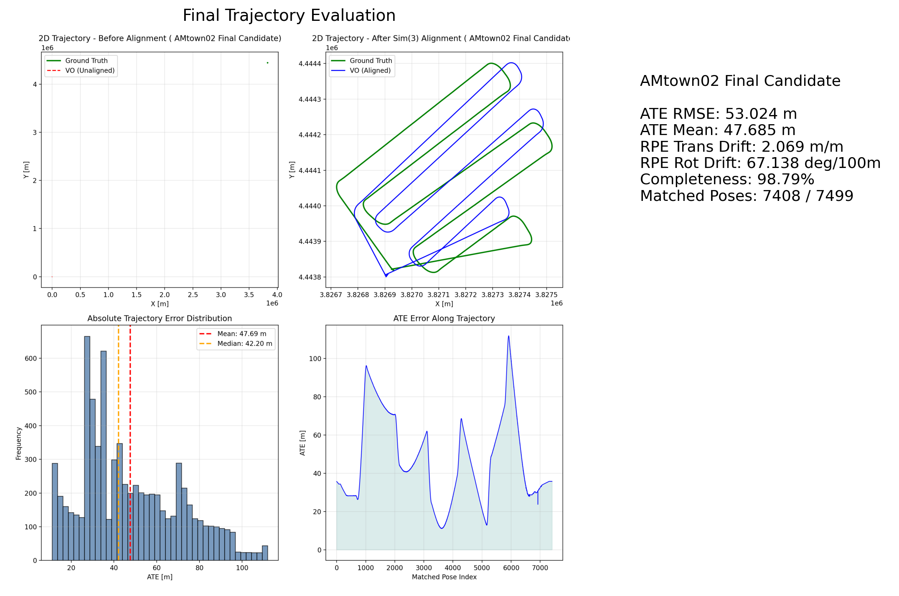

# Visual Odometry Module (ORB-SLAM3) — AAE5303 Group Project

This folder contains the **Visual Odometry (VO)** part of our AAE5303 group project for low-altitude aerial vehicle perception.

## Context

According to the course design, the final group project integrates three perception components:

- Visual Odometry
- 3D scene reconstruction
- Semantic segmentation

Our group repo is organized accordingly, and this module focuses on the **VO / monocular ORB-SLAM3** part on the **AMtown02** sequence. :contentReference[oaicite:1]{index=1}

## Team

- **Evelyn4k4k** — Visual Odometry (this module)
- **wymmust** — 3D Reconstruction
- **taiwanhaitong-crypto** — Semantic Segmentation

## Objective

The goal of this module is to run and tune a monocular ORB-SLAM3 pipeline on a selected UAV sequence, export the estimated trajectory, align it with ground truth, evaluate it quantitatively, and summarize the result in a reproducible way.

This aligns with the course focus on robust spatial perception for low-altitude aerial vehicles, where VO / VSLAM is one of the core technical components. 

---

## Dataset

- **Sequence**: `AMtown02`
- **Source family**: MARS-LVIG / UAVScenes course pipeline
- **Input modality used in this module**: monocular RGB images

The teaching plan states that the course project is built around open-source multi-sensor UAV datasets, including MARS-LVIG for VSLAM and 3D reconstruction. :contentReference[oaicite:3]{index=3}

---

## Method

We use **ORB-SLAM3** as the visual SLAM / visual odometry backend.

In the course material, Week 3 introduces the VO framework and its measurement-model-estimation view, while Week 4 focuses on ORB-SLAM3 and practical tuning ideas such as feature count, pyramid levels, and downsampling tricks. 

### Main pipeline

1. Extract images from the selected bag / sequence
2. Extract and synchronize ground truth to image timestamps
3. Run monocular ORB-SLAM3 with a tuned camera configuration
4. Export:
   - `CameraTrajectory.txt`
   - `KeyFrameTrajectory.txt`
5. Evaluate the estimated trajectory against synchronized ground truth
6. Generate result figures and summary metrics

---

## Folder Structure

```text
vo/
├── README.md
├── requirements.txt
├── docs/
│   ├── camera_config_amtown02_tuned.yaml
│   ├── camera_config_amtown02_medium.yaml
│   ├── camera_config_amtown02_medium_2x.yaml
│   └── camera_config_amtown02_aggressive.yaml
├── scripts/
│   ├── data_prep/
│   │   ├── extract_images_amtown02.py
│   │   ├── extract_groundtruth_amtown02.py
│   │   ├── sync_groundtruth_to_images.py
│   │   └── downsample_images_2x.py
│   ├── inspection/
│   │   ├── inspect_bag.py
│   │   ├── inspect_gt_topics.py
│   │   └── inspect_selected_topics.py
│   ├── evaluate_vo_accuracy.py
│   └── generate_report_figures.py
├── final_candidate/
│   ├── CameraTrajectory_best.txt
│   ├── KeyFrameTrajectory_best.txt
│   ├── metrics_best.json
│   └── figures/
│       ├── trajectory_evaluation_best.png
│       ├── metrics_comparison.png
│       ├── sample_images.png
│       └── best_result_summary.png
└── leaderboard/
    └── submission_template.json
````

---

## Environment

Recommended environment follows the course setup style: GitHub + Cursor + Docker / WSL workflow. The Week 1 material explicitly frames the class around a reproducible GitHub-based workflow for group development.

Typical local environment used in this project:

* Ubuntu / WSL2
* Python 3.10+
* ORB-SLAM3 built locally
* `evo` for trajectory evaluation
* matplotlib / numpy for report figure generation

---

## Reproducibility

### 1. Prepare data

Extract images and ground truth:

```bash
python3 scripts/data_prep/extract_images_amtown02.py
python3 scripts/data_prep/extract_groundtruth_amtown02.py
python3 scripts/data_prep/sync_groundtruth_to_images.py
```

Optional downsampling experiment:

```bash
python3 scripts/data_prep/downsample_images_2x.py
```

### 2. Run ORB-SLAM3

Example command:

```bash
cd ~/projects/ORB_SLAM3
./Examples/Monocular/mono_tum \
  Vocabulary/ORBvoc.txt \
  /path/to/vo/docs/camera_config_amtown02_tuned.yaml \
  /path/to/vo/data/extracted_images
```

### 3. Copy final trajectories

After the run finishes, save / archive:

* `CameraTrajectory.txt` → `final_candidate/CameraTrajectory_best.txt`
* `KeyFrameTrajectory.txt` → `final_candidate/KeyFrameTrajectory_best.txt`

### 4. Evaluate trajectory

```bash
python3 scripts/evaluate_vo_accuracy.py \
  --groundtruth data/ground_truth/ground_truth_synced.txt \
  --estimated final_candidate/CameraTrajectory_best.txt \
  --t-max-diff 0.1 \
  --delta-m 10 \
  --workdir final_candidate/figures_eval \
  --json-out final_candidate/metrics_best.json
```

### 5. Generate report figure

```bash
python3 scripts/generate_report_figures.py \
  --gt data/ground_truth/ground_truth_synced.txt \
  --est final_candidate/CameraTrajectory_best.txt \
  --evo-ape-zip final_candidate/figures/ate.zip \
  --out final_candidate/figures/trajectory_evaluation_best.png \
  --t-max-diff 0.1 \
  --title-suffix "AMtown02 Final Candidate"
```

---

## Final Result

### Best selected monocular VO result on AMtown02

* **ATE RMSE (m):** 53.024393997361074
* **ATE Mean (m):** 47.685467150166886
* **ATE Std (m):** 23.18798355738885
* **RPE Trans Drift (m/m):** 2.0690741089448714
* **RPE Rot Drift (deg/100m):** 67.13804694584911
* **Completeness (%):** 98.78650486731564
* **Matched poses:** 7408 / 7499

These values are stored in:

```text
final_candidate/metrics_best.json
```

---

## Key Observations

1. **Camera trajectory performed much better than keyframe-only trajectory** for final reporting.
2. **Ground-truth synchronization to image timestamps** was necessary to obtain a fair completeness score.
3. Moderate hyperparameter tuning improved stability, while overly aggressive settings degraded ATE noticeably.
4. Image downsampling increased completeness in some cases but did not necessarily improve absolute accuracy.

These observations are consistent with the engineering emphasis in the ORB-SLAM3 tutorial slides, which discuss feature-number tuning and image downsampling as practical robustness levers. 

---

## Figures

### Final trajectory evaluation


### Metrics comparison across configurations


### Sample images from AMtown02


### Final result summary



---

## Notes on Course Integration

The AAE5303 project pipeline progresses from:

* **UAV trajectory / pose estimation**
* **3D mapping**
* **semantic segmentation**
* **higher-level navigation / decision making**

This VO module corresponds to the first stage of that perception stack.

---

## Repository Inspection Requirement

The teaching plan states that the private project repository should be reproducible and that the Lead TA and Dr Hsu should be added as collaborators for inspection. 

Required collaborators:

* `Qian9921`
* `qmohsu`

---

## Acknowledgements

* Course: **AAE5303 Robust Control Technology in Low-Altitude Aerial Vehicle**
* Instructor: **Dr Li-Ta Hsu**
* Visual SLAM baseline: **ORB-SLAM3**
* Course references:

  * Week 3: VO-related frameworks
  * Week 4: ORB-SLAM3 tutorial
  * Teaching plan and project milestone documents

````
